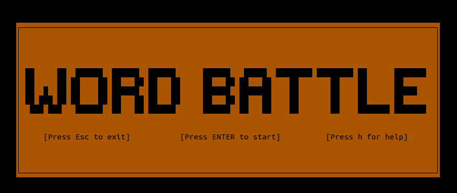
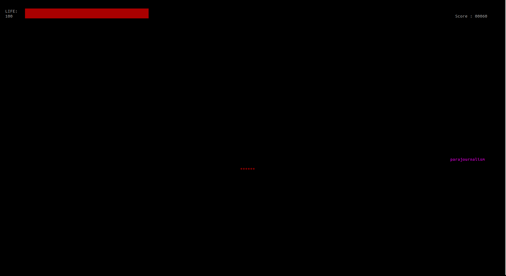
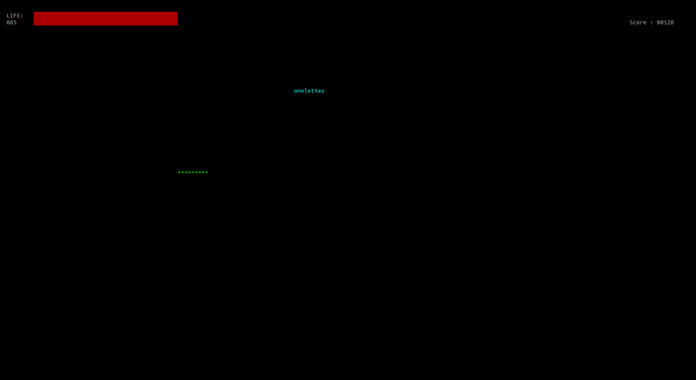
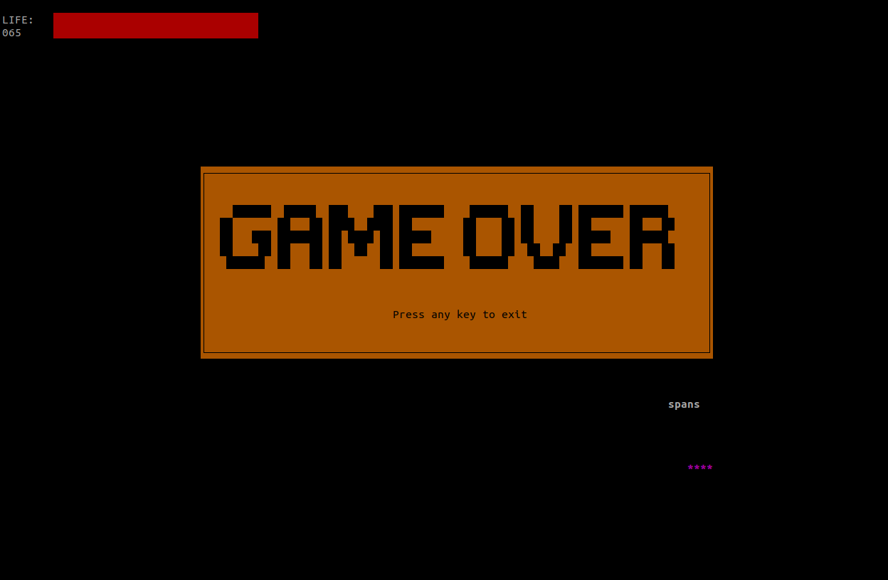
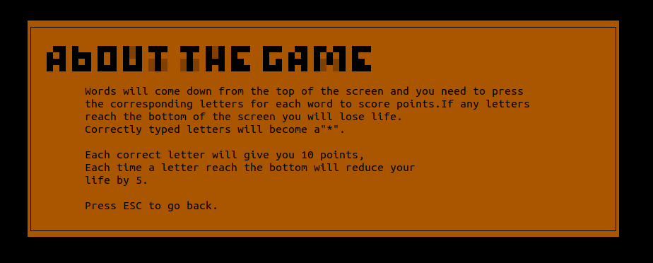

# About the game
Random words will come down from the top of the screen and you need to press
the corresponding letters for each word to score points.If any letters 
reach the bottom of the screen you will lose life.
Correctly typed letters will become a"*" and
give you **10** points,
Each time a letter reach the bottom will reduce your
life by **5**.

# Requirements

* Python >=3.8

# Installation
   ```bash
   pip install -r requirments.txt

   python main.py
   ```
# Screenshots

## Home screen
   
## Game screen
   
   
## Game over
   
## Help screen
   

##  

# History
## Version 1.0.0
* Initial release

# TODO
* <del>More random words 
* Screen alignment
# Credits
* Thanks [sfxr.me](https://sfxr.me) for providing sounds

* Thanks to the [Pygame](https://www.pygame.org/) for providing their libary.

* Random words generated using [random-word-api.herokuapp.com](https://random-word-api.herokuapp.com/home)
